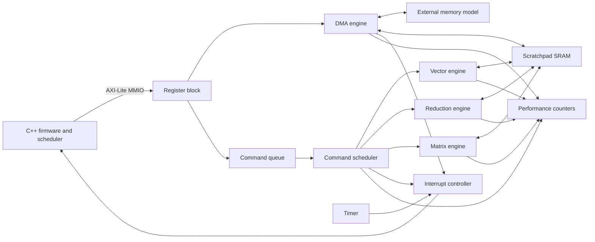

# Inference Accelerator SoC

A pure-simulation SystemVerilog SoC for exploring command-driven accelerators,
firmware-controlled data movement, reusable verification, and computer-architecture
performance analysis.

The platform combines a five-channel AXI-Lite control interface, DMA, scratchpad SRAM,
a hardware command scheduler, interrupts, a timer, performance counters, and three
integer accelerators. C++ firmware programs the design through cycle-accurate MMIO,
submits workloads, blocks tasks on hardware completion, and services interrupts.

## Architecture



The implementation is simulation-only. It does not include a physical-board flow or a
processor core. The firmware model is deliberately separated from RTL so a control core
can be attached at the MMIO and interrupt boundaries in a future revision.

## Planned Features

- Parameterized SystemVerilog RTL with shared packages and explicit interfaces.
- Valid/ready flow control with backpressure and protocol assertions.
- Read-first scratchpad SRAM and reusable FIFO/skid-buffer primitives.
- Exact-length DMA transfers between external memory and scratchpad.
- Round-robin and priority-first command scheduling with starvation protection.
- Signed integer vector, reduction, and tiled matrix operations.
- Timer, interrupt controller, sticky error reporting, and 64-bit counters.
- C++ drivers, task descriptors, cooperative scheduling, and ISR-style completion.
- Fast non-UVM simulation with a cycle-accurate C++ harness.
- UVM agents, constrained-random sequences, scoreboards, assertions, and coverage.
- Deterministic golden models and repeatable performance reports.

## Quick Start

List every public target:

```sh
make help
```

Run the open-source checks after Verible and Verilator are installed:

```sh
make fmt
make lint
make verilator-lint
make verilator-build
make verilator-smoke
make verilator-regress
make docs
make ci
```

Run the class-based verification flow with a supported UVM simulator:

```sh
make uvm-compile
make uvm-smoke UVM_TEST=smoke_test UVM_SEED=1
make uvm-regress UVM_SEEDS="1 7 19 41"
make coverage
```

Targets never report success when a required tool or source artifact is absent. They
exit with a specific prerequisite message instead.

## Tool Requirements

| Purpose | Tool |
| --- | --- |
| Build orchestration | GNU Make and Bash |
| Documentation and regression scripts | Python 3 |
| Firmware and simulation harness | C++17 compiler |
| SystemVerilog formatting and lint | Verible |
| RTL lint and cycle-accurate simulation | Verilator |
| Class-based verification | Questa or compatible UVM simulator |
| Optional comparative synthesis estimates | Yosys |

The current environment audit is recorded in [docs/project_plan.md](docs/project_plan.md).
Architecture, verification scope, register behavior, and address regions are defined in
the `docs/` directory and evolve with each implementation milestone.

## Repository Layout

| Path | Purpose |
| --- | --- |
| `rtl/` | Packages, interfaces, reusable blocks, accelerators, and SoC top |
| `firmware/` | Drivers, workload APIs, task model, and cooperative scheduler |
| `sim/verilator/` | C++ harness and behavioral memory |
| `sim/scripts/` | Simulator build and regression entry points |
| `uvm/` | Agents, environment, sequences, scoreboards, coverage, and tests |
| `models/` | C++ and Python reference models |
| `tests/` | Directed cases, random configurations, and regression manifests |
| `scripts/` | Formatting, lint, coverage, documentation, and performance tools |
| `docs/` | Architecture, interfaces, verification, and analysis |
| `perf/` | Reproducible configurations and committed result tables |

## Current Status

The architecture and command surface are defined. RTL and verification are introduced
in gated milestones listed in [docs/project_plan.md](docs/project_plan.md). Passing
claims are made only for checks that have been executed with available tools.

## License

This project is available under the MIT License.
