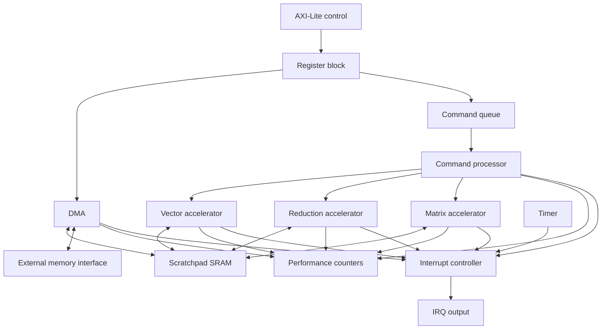

# Architecture

## System Boundary

The design is a simulation platform with three boundaries:

1. A five-channel, single-beat AXI-Lite subset for firmware-visible MMIO.
2. A request/response memory interface connecting the SoC to a byte-addressable
   external memory model.
3. One level-sensitive interrupt output observed by the firmware model.

The firmware model is not synthesizable and is not part of the SoC RTL. It advances the
simulation clock, issues bus transactions, services interrupts, and schedules software
tasks.

## Block Diagram

## Control Flow

Firmware writes a complete command descriptor into staging registers and commits it with
`CMD_SUBMIT`. The register block captures the descriptor atomically and presents it to
the command queue through valid/ready flow control. A rejected submission sets a sticky
error bit; a descriptor is never partially enqueued.

The command processor validates the opcode, selects a ready accelerator according to the
configured scheduling policy, and holds the descriptor stable until accepted. Completion
contains command ID and status. The processor increments completion counters, records
errors, and raises the command-complete interrupt source.

## Data Flow

DMA moves exact byte counts between external memory and scratchpad. Accelerator commands
name scratchpad byte addresses. The scratchpad wrapper arbitrates DMA and accelerator
accesses, checks bounds, and preserves documented read-first collision behavior.

Vector commands process one signed element per accepted beat after pipeline fill.
Reduction commands consume a bounded vector and produce one result. Matrix commands use
scratchpad-resident signed matrices and iterate over simulation-friendly tiles.

## Interrupt Flow

DMA completion, command completion, accelerator error, timer tick, and global error are
sticky pending sources. A source remains pending until firmware writes its bit to
`IRQ_STATUS`. The external interrupt is the reduction OR of pending and enabled bits.
Clearing one source does not affect another.

## Performance Flow

Events from DMA, queue, scheduler, accelerators, memory stalls, and interrupt handling
feed 64-bit saturating counters. Firmware selects a counter through `PERF_SELECT` and
reads a coherent low/high snapshot. Counter clear is an explicit control pulse.

## Reset Strategy

Reset initializes control state, valid bits, queue pointers, occupancy, pending
interrupts, visible counters, and required status. Scratchpad and large datapath arrays
are not reset. Tests initialize memory before use and use randomized uninitialized
datapath state where supported to expose accidental dependencies.
