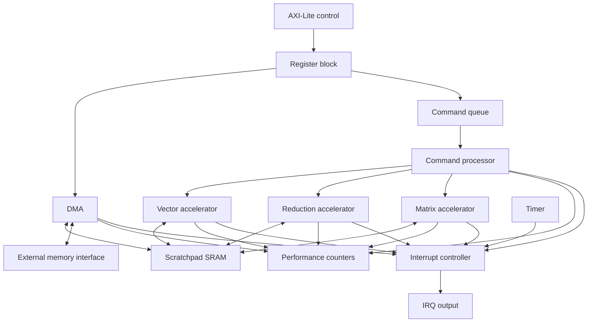

# Architecture

## System Boundary

The design is a simulation platform with three boundaries:

1. A five-channel, single-beat AXI-Lite subset for firmware-visible MMIO.
2. A request/response memory interface connecting the SoC to a byte-addressable
   external memory model.
3. One level-sensitive interrupt output observed by the firmware model.

The firmware model is not synthesizable and is not part of the SoC RTL. It advances the
simulation clock, issues bus transactions, services interrupts, and schedules software
tasks.

## Block Diagram

## Control Flow

Firmware writes a complete command descriptor into staging registers and commits it with
`CMD_SUBMIT`. The register block captures the descriptor atomically and presents it to
the command queue through valid/ready flow control. A rejected submission sets a sticky
error bit; a descriptor is never partially enqueued.

The command processor validates the opcode, selects a ready accelerator according to the
configured scheduling policy, and holds the descriptor stable until accepted. Completion
contains command ID and status. The processor increments completion counters, records
errors, and raises the command-complete interrupt source.

The shared-slot command queue supports round-robin slot selection and priority-first
selection. Priority ties use wait age. A programmable starvation threshold overrides
priority for an old descriptor, while a zero threshold disables the override. The
baseline processor permits one command in flight and holds completion until firmware
accepts it. Detailed behavior is specified in
[command_scheduler.md](command_scheduler.md).

The vector accelerator reads packed elements from scratchpad through a backpressured
memory initiator. Add, multiply, and clamp consume two source vectors; scale loads one
scalar before traversing the first source; ReLU consumes one source. Lanes execute in
parallel and the final write uses byte enables for a partial word. Signedness and
saturation are descriptor flags. Detailed arithmetic and address behavior is specified
in [vector_accelerator.md](vector_accelerator.md).

The reduction accelerator applies a balanced tree to packed lanes, then combines one
partial result per memory word in a wide accumulator. Sum converts to element width only
after all inputs are consumed; maximum returns an existing element. One byte-enabled
result is written to scratchpad. Detailed precision and tree behavior is specified in
[reduction_accelerator.md](reduction_accelerator.md).

The matrix accelerator traverses compact row-major matrices in 2-by-2 output tiles. For
each inner-dimension step, it loads the valid A rows and B columns once and updates every
tile accumulator in parallel. Edge tiles suppress inactive outputs. Accumulators remain
wide until final signed or unsigned truncating or saturating conversion. Detailed layout
and precision behavior is specified in [gemm_accelerator.md](gemm_accelerator.md).

## Data Flow

DMA moves exact byte counts among legal external-memory and scratchpad regions. It uses
independent source-read and destination-write ports, buffers one word, supports request
backpressure and response latency, and marks parameterized logical burst boundaries.
Accelerator commands name scratchpad byte addresses. The scratchpad wrapper arbitrates
DMA and accelerator accesses, checks bounds, and preserves documented read-first
collision behavior.

Vector commands process packed elements. Reduction commands consume a bounded vector and
produce one result. Matrix commands use scratchpad-resident signed or unsigned matrices
and reuse source elements across parameterized output tiles.

## Interrupt Flow

DMA completion, command completion, accelerator error, timer tick, and global error are
sticky pending sources. A source remains pending until firmware writes its bit to
`IRQ_STATUS`. The external interrupt is the reduction OR of pending and enabled bits.
Clearing one source does not affect another, and a source event wins over a simultaneous
clear. The controller records service latency from external assertion to clearing an
enabled pending source.

## Performance Flow

Events from DMA, queue, scheduler, accelerators, memory stalls, and interrupt handling
feed 64-bit saturating counters. Firmware selects a counter through `PERF_SELECT` and
reads a coherent low/high snapshot. Count metrics accumulate, queue occupancy and
interrupt latency retain maxima, and counter clear is an explicit control pulse.

## Reset Strategy

Reset initializes control state, valid bits, queue pointers, occupancy, pending
interrupts, visible counters, and required status. Scratchpad and large datapath arrays
are not reset. Tests initialize memory before use and use randomized uninitialized
datapath state where supported to expose accidental dependencies.
